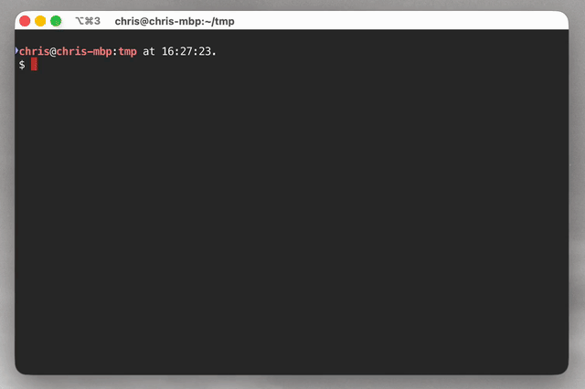

# AXLE MCP Server

A [Model Context
Protocol](https://modelcontextprotocol.io/docs/getting-started/intro) server for
[Axiom Lean Engine](https://axle.axiommath.ai) — exposes Lean verification and
manipulation tools to AI agents.




## Installation

1. Create a free API key:
   [https://axle.axiommath.ai/app/console](https://axle.axiommath.ai/app/console).

2. Add the MCP server to your client using one of the options below.

### Claude Code

Replace `your_api_key_here` with the API key you created in step 1:
```bash
claude mcp add axle -e AXLE_API_KEY=your_api_key_here -- uvx --from axiom-axle-mcp axle-mcp-server
```

### Other MCP clients (Cursor, Windsurf, Claude Desktop, VS Code, Cline, etc.)

Add the following to your client's MCP config file. Replace `your_api_key_here`
with the API key you created in step 1:
```json
{
  "mcpServers": {
    "axle": {
      "command": "uvx",
      "args": ["--from", "axiom-axle-mcp", "axle-mcp-server"],
      "env": {
        "AXLE_API_KEY": "your_api_key_here"
      }
    }
  }
}
```

### Claude (web / desktop / mobile)

A hosted instance runs at `https://mcp.axiommath.ai/mcp`. You only need to do
this once; after setup, Axle is available in every future conversation.

1. Open Claude and click your profile avatar → **Settings**.
2. Go to the **Connectors** tab.
3. Scroll to the bottom of the page and click **Add custom connector**.
4. Fill in:
   - **Name:** `Axle`
   - **Remote MCP server URL:** `https://mcp.axiommath.ai/mcp`
5. Expand **Advanced settings** and paste the API key from step 1 as the
   **OAuth Client ID / Bearer token**.
6. Click **Add**.
7. In any chat, open the tools menu (the **+** or paperclip icon in the
   composer) → **Connectors** → toggle **Axle** on. You should see the Axle
   tools listed.
