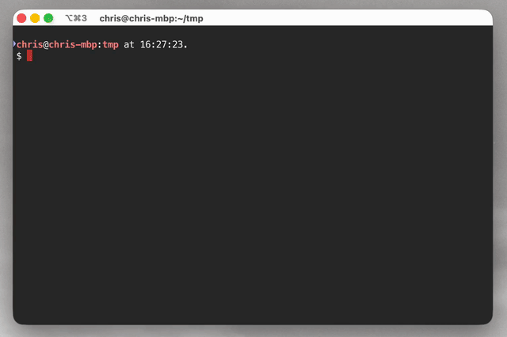

# AXLE MCP Server

A [Model Context Protocol](https://modelcontextprotocol.io/docs/getting-started/intro)
server for [Axiom Lean Engine (AXLE)](https://axle.axiommath.ai) — exposes Lean
verification and manipulation tools to Claude, ChatGPT and any other MCP client.



A hosted instance runs at **`https://mcp.axiommath.ai/mcp`**. Every client below
authenticates with your own AXLE API key: either you sign in with it once in a
browser (Claude web/desktop/mobile, ChatGPT, Claude Code) or you pass it as a
header / environment variable (Claude Code, Cursor, VS Code, ...).

## 1. Get an API key

Create a free API key at
[https://axle.axiommath.ai/app/console](https://axle.axiommath.ai/app/console).
Keep it secret; anyone holding it can use AXLE as you.

## 2. Connect your client

### Claude (web, desktop, mobile)

Custom connectors are available on Free, Pro, Max, Team and Enterprise plans.

1. Open [Customize → Connectors](https://claude.ai/customize/connectors).
2. Click **Add custom connector** (Team/Enterprise owners: **Organization
   settings → Connectors → Add → Custom → Web**).
3. Enter:
   - **Name:** `Axle`
   - **Remote MCP server URL:** `https://mcp.axiommath.ai/mcp`
   - Leave the OAuth client settings at their defaults. Claude detects that the
     server uses OAuth and registers itself automatically.
4. Click **Add**, then **Connect**. A sign-in page from `mcp.axiommath.ai`
   opens. Paste your AXLE API key and click **Connect**.
5. In a chat, open the **+** menu → **Connectors** and switch **Axle** on.

You only do this once per account. Team/Enterprise members each connect with
their own API key. If you ever want to change the key, remove the connector and
add it again.

### ChatGPT (web)

Custom MCP servers need a Plus, Pro, Business, Enterprise or Education account
and **Developer mode**.

1. In ChatGPT open **Settings → Security and login** and turn on **Developer
   mode**.
2. Go to [ChatGPT Plugins](https://chatgpt.com/plugins), click the **+** button
   and create a new connection:
   - **Name:** `Axle`
   - **Description:** `Lean 4 proof verification with Axiom Lean Engine`
   - **MCP server URL:** `https://mcp.axiommath.ai/mcp`
   - **Authentication:** **OAuth** (leave client ID / secret empty)
3. Create it. ChatGPT opens the AXLE sign-in page; paste your API key and click
   **Connect**. ChatGPT then lists the discovered tools.
4. In a new conversation, add Axle from the tools menu (**+** → **Developer
   mode** → select **Axle**).

### Claude Code

Remote server with browser sign-in (recommended):

```bash
claude mcp add --transport http axle https://mcp.axiommath.ai/mcp
```

Then run `/mcp` inside Claude Code (or `claude mcp login axle`) and paste your
API key on the page that opens. Add `-s user` to make it available in every
project.

Remote server with the key in a header (no browser, good for CI and shared
machines):

```bash
claude mcp add --transport http axle https://mcp.axiommath.ai/mcp \
  --header "Authorization: Bearer your_api_key_here"
```

Local stdio server (runs the server on your machine; also enables `file_uri`
so tools can read Lean files straight from disk):

```bash
claude mcp add axle -e AXLE_API_KEY=your_api_key_here -- uvx --from axiom-axle-mcp axle-mcp-server
```

### Cursor, Windsurf, VS Code, Claude Desktop (config file), Cline, ...

Any client that speaks streamable HTTP can use the hosted server. Put your key
in the header (or leave the header out and let the client run the OAuth sign-in
if it supports it):

```json
{
  "mcpServers": {
    "axle": {
      "type": "http",
      "url": "https://mcp.axiommath.ai/mcp",
      "headers": {
        "Authorization": "Bearer your_api_key_here"
      }
    }
  }
}
```

Or run the server locally over stdio:

```json
{
  "mcpServers": {
    "axle": {
      "command": "uvx",
      "args": ["--from", "axiom-axle-mcp", "axle-mcp-server"],
      "env": {
        "AXLE_API_KEY": "your_api_key_here"
      }
    }
  }
}
```

## Tools

Most tools are generated from the AXLE API's `/v1/endpoints` — `verify_proof`,
`check`, `merge`, `sorry2lemma` and friends. Alongside them the server provides:

| Tool | Purpose |
| --- | --- |
| `read_docs` | Read the AXLE documentation. Call with no arguments for the page index, then `page="verify_proof"` for one page. |
| `list_environments` | List the available Lean environments. |
| `share_url` | Turn a prior call's `request_id` into a permanent shareable webapp URL. |
| `read_share_url` | Read back the inputs and result behind a share URL. |

All tools except `share_url` are marked read-only, so ChatGPT and other clients
that gate write actions don't ask for confirmation on every call.

## How authentication works

Claude and ChatGPT can only attach an OAuth access token to a remote MCP
server; there is no per-user API-key field. So in HTTP mode the server is also
its own OAuth 2.1 authorization server:

- `POST /mcp` without a valid bearer token answers `401` with a
  `WWW-Authenticate: Bearer resource_metadata=...` challenge, and the discovery
  documents live at `/.well-known/oauth-protected-resource[/mcp]` and
  `/.well-known/oauth-authorization-server`.
- Clients register with Dynamic Client Registration (`/register`) or a Client
  ID Metadata Document (an `https://` `client_id`), then run the authorization
  code flow with PKCE (S256).
- The `/authorize` step is the sign-in page: you paste your AXLE API key, the
  server checks it against AXLE, and seals it inside the access and refresh
  tokens it issues (encrypted with `AXLE_MCP_TOKEN_SECRET`). The model never
  sees the key.
- On every MCP request the server unseals the key and forwards it to AXLE as
  `Authorization: Bearer <key>`. Access tokens last one hour and are refreshed
  automatically by the client; refresh tokens expire 90 days after you last
  signed in.
- A raw AXLE API key sent directly as `Authorization: Bearer <key>` is also
  accepted (after being validated against AXLE), which is what the header-based
  setups above use.

Nothing is stored server-side, so the deployment stays stateless.

## Self-hosting

```bash
docker build -t axle-mcp .
docker run -p 8080:8080 \
  -e AXLE_MCP_TOKEN_SECRET="$(openssl rand -hex 32)" \
  -e AXLE_MCP_PUBLIC_URL=https://mcp.example.com \
  axle-mcp
```

| Variable | Purpose |
| --- | --- |
| `AXLE_MCP_TOKEN_SECRET` | **Required in production.** Random string that seals the OAuth tokens. Must be the same on every instance; changing it signs everyone out. Unset ⇒ random per process, so tokens die on restart. |
| `AXLE_MCP_PUBLIC_URL` | Public origin (no path), e.g. `https://mcp.example.com`. Optional; otherwise derived from `X-Forwarded-Proto` / `Host`. |
| `AXLE_API_URL` | Upstream AXLE API. Default `https://axle.axiommath.ai`. |
| `AXLE_DEFAULT_ENVIRONMENT` | Override the default Lean environment (default: newest `lean-4.x.y`). |
| `AXLE_MCP_ALLOW_ANONYMOUS` | `1` to also serve requests that carry no credentials at all (AXLE's anonymous tier). Off by default. |
| `AXLE_API_KEY` | The key sent to AXLE in stdio mode. In HTTP mode it is only used for requests that carry no credentials when `AXLE_MCP_ALLOW_ANONYMOUS=1`. |
| `PORT` | HTTP port (default 8080). |

The MCP endpoint must be reachable over public HTTPS with no redirects on
`/mcp`, and the `/.well-known/*` paths must be served from the same origin.

## Development

```bash
uv sync --extra http --group dev
uv run pytest            # unit tests + an end-to-end OAuth flow against a mock AXLE
uv run ruff check . && uv run mypy axle_mcp_server
uv run axle-mcp-server --http --port 8080   # local HTTP server
```

To try the OAuth flow locally with Claude Code:

```bash
AXLE_MCP_TOKEN_SECRET=dev uv run axle-mcp-server --http --port 8080
claude mcp add --transport http axle-dev http://127.0.0.1:8080/mcp
claude mcp login axle-dev
```
